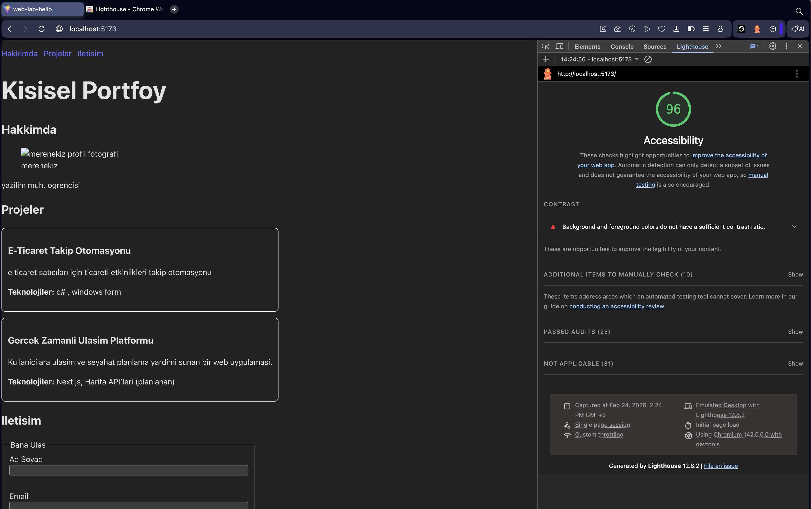

# Web LAB-2 - Semantic Portfolio (React + TS)

## Hakkinda
Bu proje, Web Tasarimi ve Programlama dersi LAB-2 kapsaminda
semantik HTML5 etiketleri ve erisilebilirlik (a11y) prensipleri kullanilarak
hazirlanmis kisisel portfoy sayfasidir.

## Gelistirici

- **Ad Soyad:** mustafa eren ekiz
- **Ogrenci No:** 235541079


## Kullanilan Teknolojiler
- React
- TypeScript
- Vite

## Ozellikler (LAB-2 Gereksinimleri)
- Semantik yapilandirma: `header`, `nav`, `main`, `section`, `article`, `footer`
- Skip link: "Ana icerige atla"
- `nav` icin `aria-label`
- Form erisilebilirligi: `label`/`htmlFor`, `required`, `minLength`, `aria-describedby`, `role="alert"`
- Lighthouse Accessibility hedefi: **90+**

## Kurulum
```bash
npm install
```


